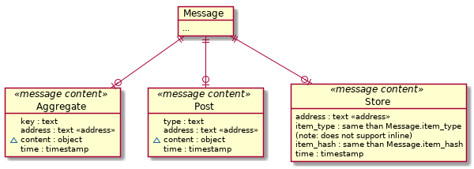

# Introduction

The Aleph.im network can be accessed from any API server. To run one yourself, you will need to install PyAleph.

## General note

Unless specified, all methods of the aleph-js API are promises, meaning they can be called using async/await methods. All our examples are written this way.

You can always have a look at what you are doing on the [aleph.im explorer](https://explorer.aleph.im/).

This explorer is a "wildcard explorer", meaning it tries to index all channels it hears of, and their content (except files). Search for your address, or just go in the messages section, select your channel, and look for your address in the last messages.

## Architecture

### Data retrieval

Data retrieval is simple, using REST APIs on any API server. There is a few helpers available in this library (depending on the requested data type).

### Data structures

All data transfered over the aleph.im network are aleph messages.

While it may seem complicated at first, this data model quickly explains itself.

Actual content sent by regular users can currently be of three types:
  - AGGREGATE: a key-value storage specific to an address
  - POST: unique data posts (unique data points, events)
  - STORE: file storage

